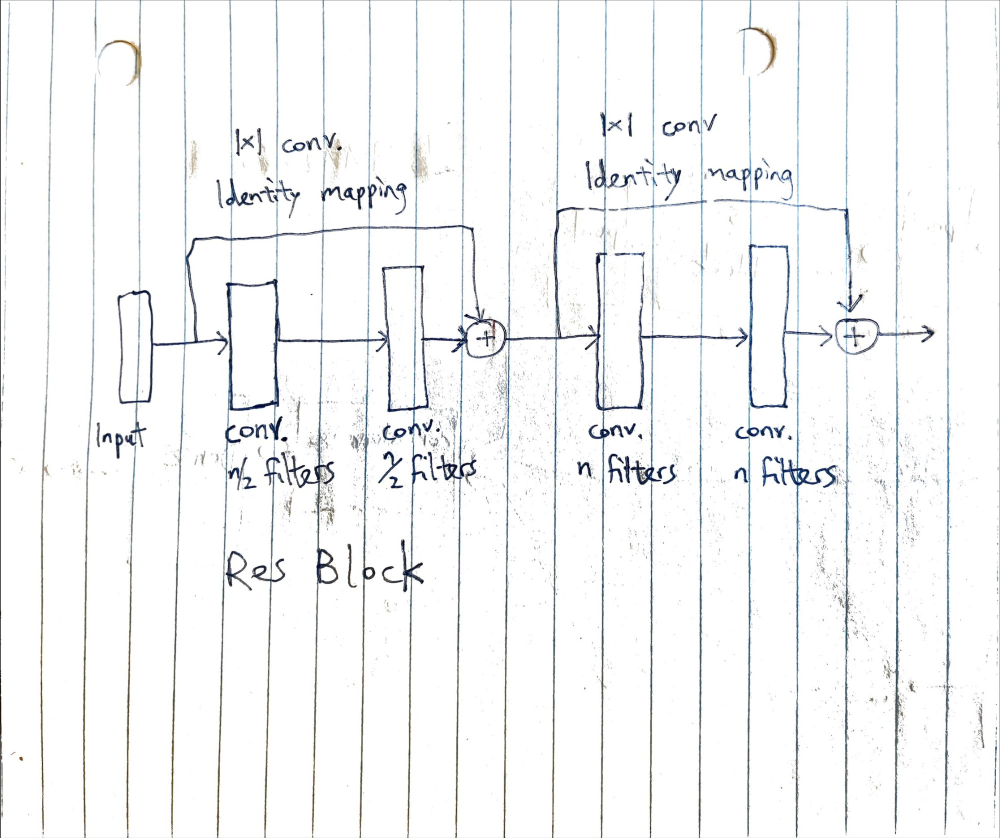
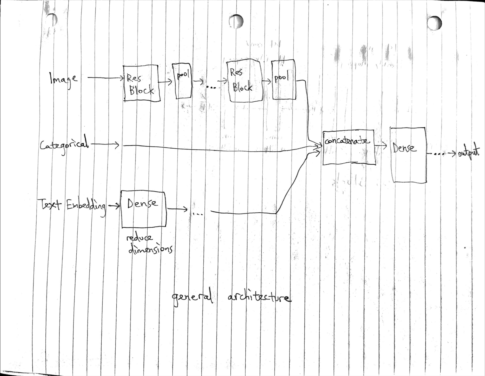

kaggle link: https://www.kaggle.com/competitions/uw-cs480-winter23

# Report

## How to run

### Expected dependencies
- sentence-similarity\
    Install using the following command
    > ! pip install sentence-similarity

    **Note:** this package is not provided in google colab\
    The below packages are already provided in colab, so you don't need to download them
- tensorflow
- pandas
- numpy
- scikit-learn

### Expected file structure

In current directory, expected to find:
- `test.csv`
- `train.csv`
- `preproc_text_embedding.ipynb`
- `training_nn_tf.ipynb`
- `testing_code.ipynb`
- directory `noisy-images/` containing the noisy images

### Steps to run
1. Run cells in `preproc_text_embedding.ipynb` sequentially.

    This should create new csv files `test_preproc.csv` and `train_preproc.csv` in current directory.\
    These are the input files whose noisy text description have been converted to a sentence embedding using a distilbert pretrained model.\
    The training and prediction will be done using the preprocessed input.

2. Run cells in `training_nn_tf.ipynb` sequentially.

    This trains a model on the training data and saves the model.\

3. Train a new model by changing the hyperparameters of the model and saving using a different unique name.

    You can do this step using the same notebook as step 2.\
    This allows you to skip the data loading and preprocesssing.\
    Just modify the hyperparameters of the model, recompile, and retrain

4. Run cells in `testing_code.ipynb`

    This notebook loads the different trained models and makes a prediction on the test set by taking the average of the predictions

## Explanation of the general model architecture

- Categorical data are one-hot encoded and then concatenated together
- Image is passed through multiple residual blocks. The architecture of residual blocks is inspired by the residual blocks described in [this paper](https://arxiv.org/pdf/1512.03385.pdf).

- Text description is passed through a pre-trained transformer to obtain a 768-dimensional vector embedding. The transformer model can be found [here](https://huggingface.co/sentence-transformers/distilbert-base-nli-mean-tokens). It is then passed through some linear layers to reduce the number of dimensions.

Then, the categorical data, text, and image are contatenated together and passed through some dense layers.\
The last layer has a softmax activation function and 27 outputs.

Train the model by modifying hyperparameters such as
- number of dense layers
- width of dense layers
- number of filters in resblocks
- number of resblocks

Each model is considered a different hypothesis in an ensemble

When doing predictions, since the last layer of all our models has a softmax activation function on 27 parameters, we can think of the output of one model as a probability distribution that the item is in each category.\
We add the probabilities of each hypothesis and take the argmax as the final prediction

### Why use begging instead of boosting?

Empirically, boosting generally performs better than bagging. However, boosting algorithms such as AdaBoost requires the models to be trained together. I want to be able to train each model independently, so I opted for bagging

